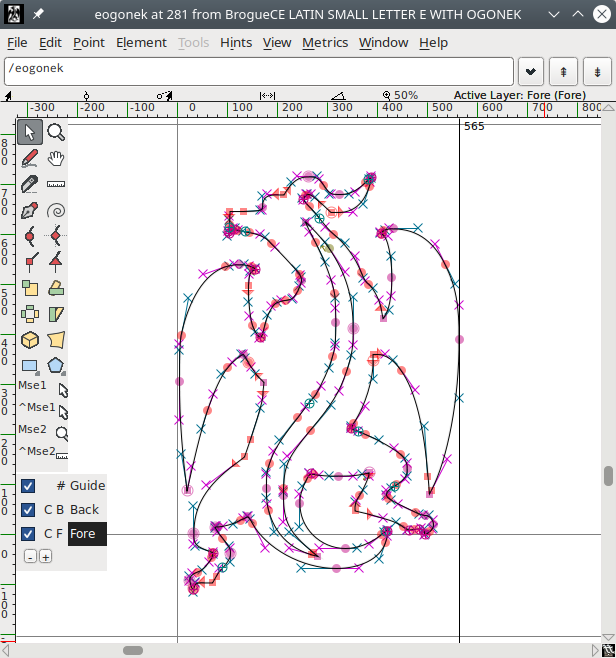

# Monospace Font for Brogue CE

A picture is worth a thousand words:

Characters' aspect ratio is 16:29 (same as `font-10.png` and `tiles-10.png` in Brogue CE 1.9).

All outlines are vectorial:

## Unicode Codepoints

Latin-1 is in the usual range 32–255.

Graphic tiles are codepoints 256–383 (U+0100 to U+017F).

The symbols (arrows, Aries, Omega, etc.) are in their usual unicode codepoints (e.g U+2191 for Up arrow) but also duplicated into range 128-155 (U+0080 to U+009F).

## Acknowledgement

Original pixel art by Oryx, with modifications by Tom Mewett, fully redrawn in vectorial by Antony Boucher.

Text characters are based on subsets of the following fonts: Monaco, Consolas, Cambria, Noto Sans, Segoe UI Symbol.

Built with FontForge.
